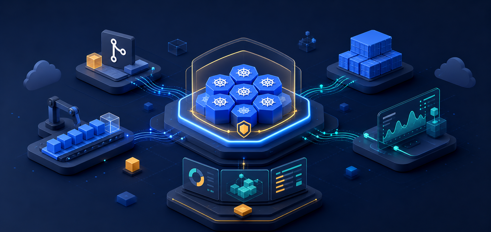
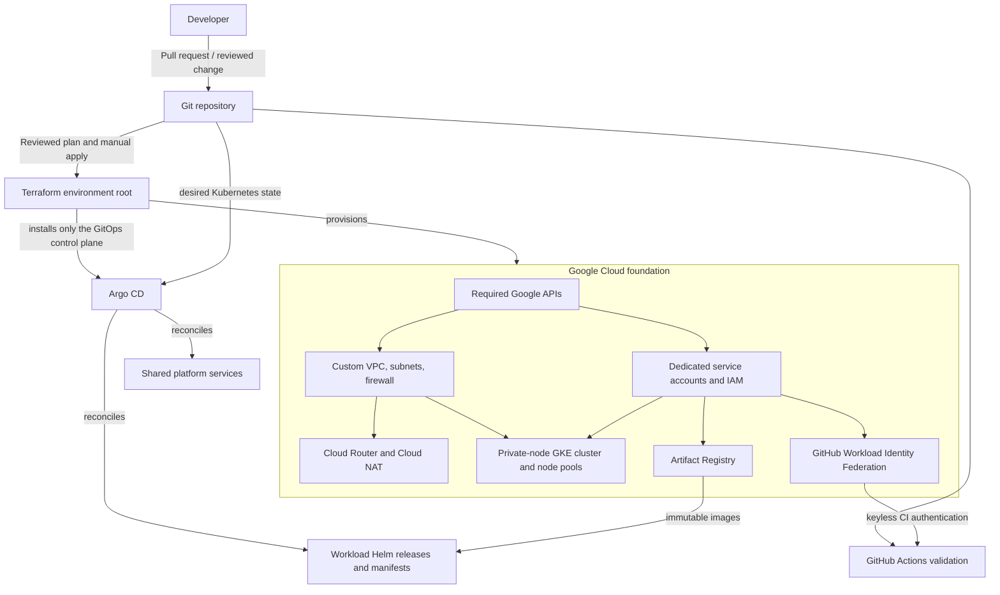
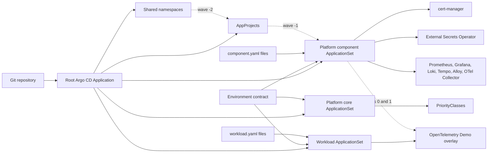
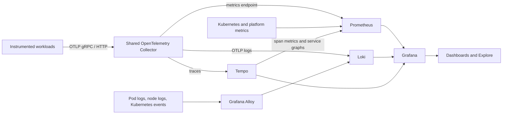
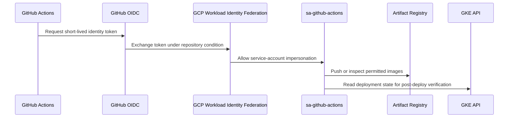

# GCP DevSecOps Platform

<p align="center">
  
</p>

<p align="center">
  
  
  
  
  
</p>

> A portfolio-grade, reusable platform engineering implementation for running Helm-based microservices on Google Cloud. Terraform provisions the cloud foundation and a minimal Argo CD bootstrap; Argo CD then continuously reconciles platform services and workload registrations from Git.

The OpenTelemetry Demo (Astronomy Shop) is included as a realistic showcase workload. It is not a platform dependency: the Terraform modules, GitOps generators, observability services, and security boundaries deliberately avoid application-specific coupling.

## Contents

- [What this project demonstrates](#what-this-project-demonstrates)
- [Implementation status](#implementation-status)
- [Architecture](#architecture)
- [Platform capabilities](#platform-capabilities)
- [Environment model](#environment-model)
- [Delivery, security, and operations](#delivery-security-and-operations)
- [Getting started](#getting-started)
- [Validation and evidence](#validation-and-evidence)
- [Roadmap and documentation](#roadmap-and-documentation)

## What this project demonstrates

This repository is designed to show a platform engineer’s operating model—not just a collection of Kubernetes manifests.

| Capability | Implementation |
| --- | --- |
| Reusable infrastructure | A typed Terraform composition joins GCP APIs, networking, IAM, GKE, Artifact Registry, and GitHub Workload Identity Federation without embedding workload details. |
| Secure GKE foundation | Custom-mode VPC, private GKE nodes, Cloud NAT, explicit firewall rules, Shielded Nodes, Workload Identity, dedicated node pools, and environment-driven controls. |
| GitOps delivery | Argo CD ApplicationSets combine component/workload contracts with environment configuration instead of duplicating Applications per environment. |
| Shared observability | Prometheus, Grafana, Loki, Tempo, Grafana Alloy, and an OpenTelemetry Collector provide metrics, logs, and traces as platform services. |
| Supply-chain patterns | GitHub OIDC federation, immutable image-tag conventions, SBOM, Trivy, Cosign, provenance workflow definitions, and Gitleaks scanning. |
| Operational rigor | Terraform waits for GitOps convergence; Grafana dashboard readiness is verified; operational helpers are read-only or explicitly reversible. |

```text
Terraform owns Google Cloud and the Argo CD hand-off.
Argo CD owns ordinary Kubernetes state.
Workloads own their Helm chart identity, values, dashboards, and alerts.
```

## Implementation status

The README distinguishes current implementation from prepared expansion so the project remains credible.

| Area | Status | Evidence |
| --- | --- | --- |
| Dev foundation | Configured implementation | Typed dev configuration, custom VPC, GKE profile, Artifact Registry, WIF, and an Argo CD bootstrap. |
| Staging and production | Reusable templates; not cluster-bound | Separate Terraform roots and GitOps policy files contain intentional <code>replace-with-*</code> values until real projects, endpoints, and Argo CD registrations are supplied. |
| GitOps platform | Implemented for dev | AppProjects, root Application, platform core, component/workload ApplicationSets, sync waves, automated sync, prune, and self-heal. |
| Observability | Implemented for dev | Seven shared component registrations, persistent backends, generic dashboards, dashboard-ready hook, and workload-owned dev dashboards/alerts. |
| Kyverno policy controller | Reserved, not claimed as complete | <code>gitops/security/</code> documents the policy domain; Kyverno is not currently installed. |
| Progressive delivery | Reserved, opt-in contract only | Workload contracts model rollout intent; <code>gitops/progressive-delivery/</code> is reserved for a future Argo Rollouts controller. |

## Architecture

### Ownership and control-plane flow



Terraform deliberately stops after the cloud foundation and Argo CD bootstrap. It does not manage normal application Deployments, Services, charts, dashboards, or workload-specific secrets. This prevents two tools from competing for the same Kubernetes resources.

### GitOps fan-out and sync order



The ApplicationSets use Git generators and a matrix of contracts plus environment configuration. Adding a compatible workload is a registration exercise—not copy/paste across dev, staging, and production.

### Shared telemetry path



The platform publishes stable, workload-neutral collector endpoints: <code>4317</code> for OTLP/gRPC and <code>4318</code> for OTLP/HTTP. Workloads choose to use them through their own values; the platform owns the backends, data sources, generic dashboards, and retention policy.

## Platform capabilities

### Cloud foundation and Terraform

Each environment calls a typed <code>platform-environment</code> composition module. It joins these focused building blocks:

| Module | Responsibility |
| --- | --- |
| <code>project</code> | Enables the GCP APIs required by the platform. |
| <code>networking</code> | Custom VPC; GKE node, pod, and service ranges; management and proxy-only subnets; Private Google Access; VPC flow logs. |
| <code>cloud-router</code> and <code>nat</code> | Regional Cloud Router and Cloud NAT for controlled private-node egress. |
| <code>firewall</code> | Internal traffic, IAP SSH, Google health checks, and explicit deny-all ingress with logging. |
| <code>service-accounts</code> | Separate identities for GKE nodes, Argo CD, External Secrets, and GitHub Actions. |
| <code>gke</code> | Configurable zonal/regional GKE, private nodes, VPC-native ranges, node pools, autoscaling, add-ons, and maintenance windows. |
| <code>artifact-registry</code> | Docker repository and least-privilege image reader/writer IAM. |
| <code>github-wif</code> | GitHub OIDC workload-identity pool/provider with repository-scoped impersonation. |
| <code>argocd-bootstrap</code> | Pinned Argo CD chart, Workload Identity bindings, root Application, and GitOps convergence gate. |

The composition input validates names, CIDRs, node-pool sizing, and GitHub repository format. Environment values stay in <code>terraform/environments/&lt;environment&gt;/terraform.tfvars</code>; reusable module code contains no workload identity.

### Kubernetes platform and scheduling

| Node pool | Scheduling purpose | Dev characteristics |
| --- | --- | --- |
| <code>system</code> | Argo CD, platform controllers, observability | Tainted <code>workload=system</code>; fixed one-node baseline. |
| <code>general</code> | Business services and dev synthetic traffic | Autoscaled general-purpose capacity. |
| <code>spot</code> | Interruptible batch or experimental work | Tainted spot capacity; can scale from zero. |

Platform <code>PriorityClass</code> resources define predictable eviction intent: <code>platform-critical</code>, <code>business-critical</code>, <code>business-standard</code> (the default), and <code>non-critical</code>. Platform Helm values schedule critical controllers to the system pool; workloads keep ownership of their own scheduling and resource choices.

### GitOps-managed platform services

| Component | Role |
| --- | --- |
| cert-manager | Certificate CRDs and a controller foundation for future certificate consumers. |
| External Secrets Operator | Secret Manager integration through Workload Identity; secrets remain references, not Git values. |
| kube-prometheus-stack | Prometheus, Grafana, Kubernetes metrics, Alertmanager, and reusable platform dashboards. |
| Loki | Central log store. |
| k8s-monitoring | Grafana Alloy collection of pod logs, node logs, and Kubernetes events. |
| Tempo | OTLP-native trace backend with service graphs and span metrics. |
| OpenTelemetry Collector | Shared OTLP gateway for traces, logs, and metrics. |

Grafana is provisioned with Prometheus, Loki, and Tempo data sources plus five workload-neutral dashboards:

- Platform / Overview
- Platform / Service Golden Signals
- Platform / Telemetry Pipeline
- Platform / Logs and Events
- Platform / Traces and Service Graph

The root application’s post-sync hook checks Grafana’s authenticated API and fails readiness unless every platform dashboard has been imported. This verifies more than pod startup.

### Showcase workload: OpenTelemetry Demo

The Astronomy Shop is installed as an external Helm chart with local, workload-owned overlays—not as a fork.

| Concern | Implementation |
| --- | --- |
| Chart source | <code>open-telemetry/opentelemetry-demo</code>, pinned to chart version <code>0.40.9</code>. |
| Environment overlays | Base values plus dev, staging, and production overlays. |
| Telemetry | Embedded Jaeger, Prometheus, Grafana, Loki, and collector subcharts are disabled in favour of shared platform backends. |
| Dev traffic | Locust runs at 50 users / 5 users per second without browser workers, providing meaningful trace and dashboard traffic. |
| Availability profile | Staging increases Tier 1 replicas; production defines three-replica Tier 1 services, zone-aware scheduling, and disables load generation. |
| Workload observability | The dev overlay owns two Grafana dashboards and three Prometheus alerts, including checkout error ratio and traffic absence. |

The generic workload contract expresses the chart source/version, values layers, namespace destinations, dashboard/alert path, network exposure, observability, secrets, and progressive-delivery intent. The platform does not hard-code those choices.

## Environment model

| Environment | Infrastructure profile | GitOps policy | Current integration state |
| --- | --- | --- | --- |
| **dev** | Zonal, private-node, cost-conscious GKE; system/general/spot pools; deletion protection disabled for deliberate rebuild exercises. | Automated sync, prune, self-heal, relaxed rollout profile. | The only environment selected by the current ApplicationSets. |
| **staging** | Template for a multi-zone private control plane, regular channel, managed features, and production-like capacity. | Automated sync, prune, self-heal, validation profile. | Project, region, endpoint, and WIF values are placeholders until a staging cluster is registered. |
| **prod** | Template for a multi-zone private endpoint, stable release channel, deletion protection, and Binary Authorization enforcement. | No automated sync or prune; self-heal under a guarded profile. | Project, region, endpoint, and WIF values are placeholders until production onboarding. |

This is not a claim that three clusters are already running. It is a reusable environment contract: dev is the current GitOps target; staging and production retain their own network ranges, capacity, security posture, and delivery policy ready for deliberate onboarding.

## Delivery, security, and operations

### Delivery model

| Stage | Control | Outcome |
| --- | --- | --- |
| Pull request / push | CI — Platform Validation | YAML linting, GitOps contract checks, shell syntax, Helm and Kustomize rendering, Terraform format/validate/TFLint, Checkov reporting, and Gitleaks scanning. |
| Infrastructure change | Manual Terraform plan or reviewed local plan | Plans are reviewed before the deliberate Terraform apply control point. No workflow applies infrastructure automatically. |
| Image build definition | Build-and-publish workflow plus workload <code>build.json</code> | Supports Buildx multi-architecture images, SHA/build tags, Artifact Registry publishing, and GitOps image-tag updates after repository variables and build inputs are configured. |
| Supply-chain definition | Security workflow | Defines CycloneDX/SPDX SBOM generation, Trivy SARIF, keyless Cosign signing, and provenance generation for an image reference. |
| GitOps merge | Dev GitOps Verification | Uses WIF, gets GKE credentials, waits for every expected Argo CD Application to become <code>Synced/Healthy</code>, then runs a read-only workload/telemetry preflight. |

Build, release, and security workflows are version-controlled platform automation. They require documented GitHub environment variables and a real workload image input before use against a cloud account; no cloud credential is stored in this repository.

### Identity boundary



- **No long-lived CI keys:** GitHub Actions uses OIDC and Workload Identity Federation.
- **Least privilege:** GKE nodes can write logs/metrics and read images; GitHub Actions can write images and read GKE state; External Secrets access is granted per configured secret.
- **Private compute:** nodes have no public IPs. Private Google Access and Cloud NAT provide egress; the firewall permits only internal, IAP SSH, and health-check traffic before an explicit deny-all rule.
- **In-cluster identity:** Argo CD and External Secrets Kubernetes service accounts are bound to dedicated Google service accounts.
- **Secret hygiene:** External Secrets is a platform capability, but the showcase workload currently requests no external secrets. Secret values are never committed.

### Safe operational helpers

| Need | Helper |
| --- | --- |
| Confirm desired state | <code>scripts/wait-for-gitops-convergence.sh --environment dev --timeout 1800</code> derives expected Applications from contracts and waits for <code>Synced/Healthy</code>. |
| Inspect workload and telemetry | <code>scripts/otel-demo-observability.sh preflight --environment dev</code> checks deployments, services, Application status, and recent synthetic-traffic logs without modifying resources. |
| Access UIs locally | <code>scripts/expose-platform-uis.sh --environment dev</code> opens localhost-only tunnels for Argo CD, the storefront, Grafana, Prometheus, and Alertmanager. |
| Read runtime credentials | <code>scripts/get-dashboard-credentials.sh --show-secrets</code> displays generated dashboard credentials only on request. |
| Demonstrate failure handling | The observability helper can enable the demo’s <code>paymentFailure</code> flag, save the exact prior state, and restore it after inspection. |

The failure demonstration is intentionally reversible: it writes a mode-restricted backup, changes only the selected flag, verifies the change, restores the exact original configuration, then removes the backup.

## Getting started

Use the full [dev bootstrap guide](docs/DEV_BOOTSTRAP.md) for the canonical flow. Infrastructure creation remains a reviewed, manual step.

### Prerequisites

- A GCP project with billing and appropriate resource-creation permissions.
- <code>gcloud</code> with the GKE auth plugin, Terraform 1.5+, <code>kubectl</code>, Helm, Git, <code>jq</code>, and Python 3.
- Application Default Credentials or an approved federated identity. Do **not** create a service-account key.
- GitHub Actions variables described in [docs/CI.md](docs/CI.md).

### Configure, bootstrap, and deploy dev

```bash
export GCP_PROJECT_ID="your-project-id"
export GCP_REGION="us-central1"

gcloud auth application-default login
./bootstrap/bootstrap.sh "$GCP_PROJECT_ID" "$GCP_REGION"

terraform fmt -check -recursive terraform
scripts/validate-gitops-contracts.py
scripts/validate-opentelemetry-demo.sh

cd terraform/environments/dev
terraform init -input=false -backend-config="bucket=${GCP_PROJECT_ID}-tfstate"
terraform validate
terraform plan -out=dev.tfplan

# Review the saved plan before this explicit control point.
terraform apply dev.tfplan
```

Push the reviewed GitOps revision to remote <code>main</code> before provisioning: Argo CD reconciles the remote repository, not uncommitted local files. Once GKE is ready, Terraform installs Argo CD, creates its root Application, and waits for GitOps convergence. Do not manually run Helm or <code>kubectl apply</code> for ordinary platform/workload resources.

### Verify and explore

```bash
cd ../../..
scripts/wait-for-gitops-convergence.sh --environment dev --timeout 1800
scripts/otel-demo-observability.sh preflight --environment dev
scripts/expose-platform-uis.sh --environment dev
```

For dashboard queries and the controlled payment-failure exercise, follow the [OpenTelemetry Demo observability runbook](docs/runbooks/opentelemetry-demo-observability.md).

## Validation and evidence

| Layer | Validation |
| --- | --- |
| Formatting and Terraform | <code>terraform fmt -check -recursive terraform</code> plus validation of every environment and module in CI. |
| Terraform quality/security | TFLint and Checkov; Checkov reports findings without applying changes. |
| GitOps contracts | <code>scripts/validate-gitops-contracts.py</code> validates component/workload registration and environment assumptions. |
| Workload rendering | <code>scripts/validate-opentelemetry-demo.sh</code> renders the pinned chart and asserts dev dependencies, traffic, scheduling, and disabled embedded backends. |
| Kubernetes manifests | CI renders workload-owned Kustomize content with <code>kubectl kustomize</code>. |
| GitOps convergence | Terraform and post-deploy CI use the same read-only script, derived from current contracts. |
| Dashboard readiness | A post-sync hook checks Grafana health and every platform dashboard UID through the authenticated API. |

## Roadmap and documentation

Deliberate next steps, rather than unsubstantiated claims:

- Register real staging and production Argo CD destinations after their infrastructure is provisioned.
- Add workload-independent Kyverno policies in the reserved security domain.
- Add Argo Rollouts and generic analysis infrastructure for workloads that opt into progressive delivery.
- Configure certificate issuers and Gateway/Ingress resources when an external exposure requirement exists; the demo is currently <code>ClusterIP</code> with localhost-only access.
- Introduce per-environment Secret Manager references when a workload needs them.
- Move Loki and Tempo from their small, persistent single-binary profile to object-storage/distributed profiles when scale calls for it.

| Goal | Read |
| --- | --- |
| Understand the architecture | [System context](docs/architecture/system-context.md), [platform architecture](docs/architecture/platform-architecture.md), and [Kubernetes architecture](docs/architecture/kubernetes-architecture.md) |
| Understand boundaries | [Reusable platform architecture](docs/architecture/reusable-platform.md) and [Terraform/workload boundary](docs/architecture/terraform-workload-boundary.md) |
| Understand GitOps and onboarding | [GitOps README](gitops/README.md) and [workload onboarding](docs/gitops/workload-onboarding.md) |
| Deploy or rebuild dev | [Dev bootstrap guide](docs/DEV_BOOTSTRAP.md) and [setup guide](docs/SETUP-GUIDE.md) |
| Configure CI | [CI guide](docs/CI.md) |
| Explore the showcase workload | [OpenTelemetry Demo README](gitops/workloads/opentelemetry-demo/README.md) |
| Review design rationale | [Architecture decision records](docs/adr/) |

---

<p align="center">
  <em>Built as a platform-engineering portfolio project: reusable infrastructure, clear GitOps boundaries, secure delivery patterns, and observable operations.</em>
</p>
