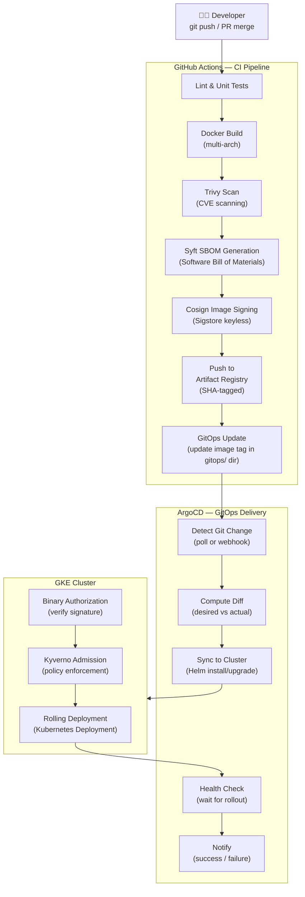

# Level 4 — CI/CD Flow

**Audience:** DevOps engineers, platform engineers.

This diagram shows the complete software delivery pipeline — from a developer's git push to a running deployment in GKE, including supply chain security steps.

---

## CI/CD Pipeline Diagram



---

## CI Pipeline Stages (GitHub Actions)

| Stage | Tool | Purpose | Blocking? |
|---|---|---|---|
| Lint & Format | `hadolint`, `golangci-lint`, etc. | Code quality gate | Yes |
| Unit Tests | Per-language test runners | Correctness | Yes |
| Docker Build | `docker buildx` (multi-arch) | Build container image | Yes |
| CVE Scan | `trivy` | Block HIGH/CRITICAL vulnerabilities | Yes (configurable threshold) |
| SBOM | `syft` | Generate SBOM artifact in SPDX format | No (publish only) |
| Image Sign | `cosign` (keyless via Workload Identity Federation) | Sign image digest in Sigstore transparency log | Yes |
| Push | `docker push` to Artifact Registry | Store immutable, tagged image | Yes |
| GitOps Update | `yq` / `kustomize edit` | Update image tag in `gitops/` directory | Yes |

---

## Image Tagging Strategy

Images are **never tagged `latest`**.

| Tag Type | Format | Example | When Used |
|---|---|---|---|
| Git SHA | `sha-{short-sha}` | `sha-a83f92d` | Every CI build — primary immutable tag |
| Semantic Version | `v{major}.{minor}.{patch}` | `v1.12.3` | Tagged releases |
| Environment | `{env}-{sha}` | `dev-a83f92d` | Environment promotion tracking |

Full image reference example:
```
asia-south1-docker.pkg.dev/platform-engineering-demo/platform-images/frontend:sha-a83f92d
```

---

## GitHub Actions Authentication (Keyless)

No long-lived secrets in GitHub. Authentication uses **Workload Identity Federation**:

```
GitHub Actions Job
        │
        ▼
OIDC Token (from GitHub)
        │
        ▼
GCP Workload Identity Pool
        │
        ▼
Impersonate sa-github-actions@{project}.iam.gserviceaccount.com
        │
        ▼
Artifact Registry Push / Secret Manager Read
```

---

## GitOps Delivery (ArgoCD)

ArgoCD polls the Git repository (or receives a webhook) and detects image tag changes in the `gitops/` directory. It then:

1. Computes the diff between Git (desired state) and cluster (actual state)
2. Runs `helm upgrade` or applies kustomize manifests
3. Waits for the rollout to complete (health check)
4. Notifies on success or failure

Key ArgoCD settings:
- **Sync Policy:** `automated` with `selfHeal: true` and `prune: true`
- **Replace strategy:** Immutable image tags ensure rollback = old tag commit
- **Sync Waves:** Namespaces → CRDs → Operators → Applications

---

## Supply Chain Security Pipeline (Phase 6 target)

```
Code Commit
    │
    ▼
Static Analysis (SAST)
    │
    ▼
Dependency Audit (SCA)
    │
    ▼
Docker Build
    │
    ▼
CVE Scan (Trivy) — block HIGH/CRITICAL
    │
    ▼
SBOM Generation (Syft → SPDX)
    │
    ▼
Image Sign (Cosign keyless → Rekor log)
    │
    ▼
Push to Artifact Registry
    │
    ▼
Binary Authorization Policy Check (on deploy)
    │
    ▼
Kyverno Admission Control
    │
    ▼
Deployment
```

---

*Previous: [Level 3 — Kubernetes Architecture](kubernetes-architecture.md)*
*Next: [Level 5 — Terraform Dependency Graph](terraform-dependency-graph.md)*
