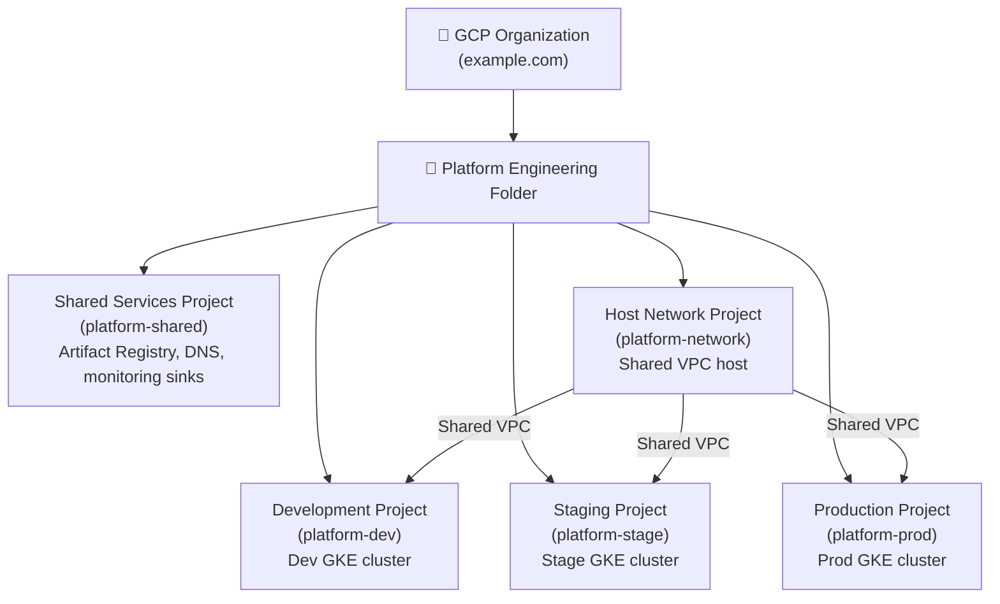
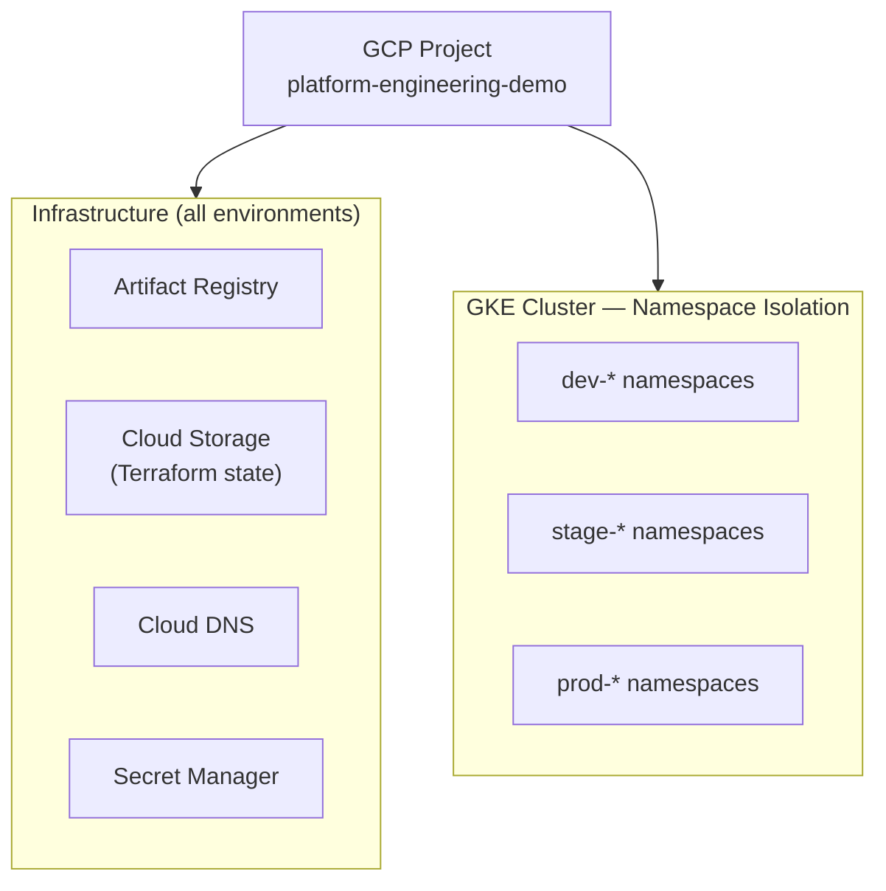

# GCP Resource Hierarchy

**Audience:** Cloud architects, platform engineers.

This document describes the GCP resource hierarchy design and the tradeoffs between an ideal enterprise layout and a practical portfolio layout.

---

## Ideal Enterprise Layout

In a real production environment, Google recommends separating workloads into multiple GCP projects for billing isolation, blast radius reduction, and policy enforcement:



**Benefits of multi-project:**
- Cost isolation per environment
- Blast radius reduction (compromised dev ≠ compromised prod)
- Separate IAM boundaries
- Independent quota management
- Easier compliance auditing

---

## Portfolio Layout (Initial Implementation)

For cost management and simplicity, we initially deploy everything into a **single GCP project**. The Terraform code is structured to expand into multi-project later without major refactoring.



**Tradeoffs:**
- ✅ Lower cost (one billing account, one GKE cluster)
- ✅ Simpler networking
- ❌ No IAM-level environment isolation
- ❌ Not true production multi-tenancy

**Migration path:** When expanding to multi-project, update `terraform/environments/{env}/backend.tf` and `main.tf` to point to separate projects. Module code requires no changes.

---

## GCP APIs to Enable

The following APIs must be enabled on the project (managed by Terraform `project/` module):

| API | Used By |
|---|---|
| `container.googleapis.com` | GKE |
| `compute.googleapis.com` | VPC, NAT, Firewall |
| `artifactregistry.googleapis.com` | Artifact Registry |
| `secretmanager.googleapis.com` | Secret Manager |
| `dns.googleapis.com` | Cloud DNS |
| `iam.googleapis.com` | Service Accounts, Workload Identity |
| `cloudresourcemanager.googleapis.com` | Terraform project management |
| `logging.googleapis.com` | Cloud Logging |
| `monitoring.googleapis.com` | Cloud Monitoring |
| `cloudtrace.googleapis.com` | Cloud Trace |
| `storage.googleapis.com` | Cloud Storage (Terraform state) |
| `iamcredentials.googleapis.com` | Workload Identity Federation (GitHub Actions) |
| `sts.googleapis.com` | Security Token Service (Workload Identity Federation) |

---

## Label Strategy

All GCP resources are labeled consistently for cost reporting and governance:

```
environment = dev | stage | prod
team        = platform
project     = otel-demo
managed-by  = terraform
owner       = satyam
```

These labels enable:
- Cost breakdown by environment in Cloud Billing
- Resource filtering in Cloud Console
- Automated governance policies (Org Policy, later)

---

*Back to: [Root README](../../README.md)*
