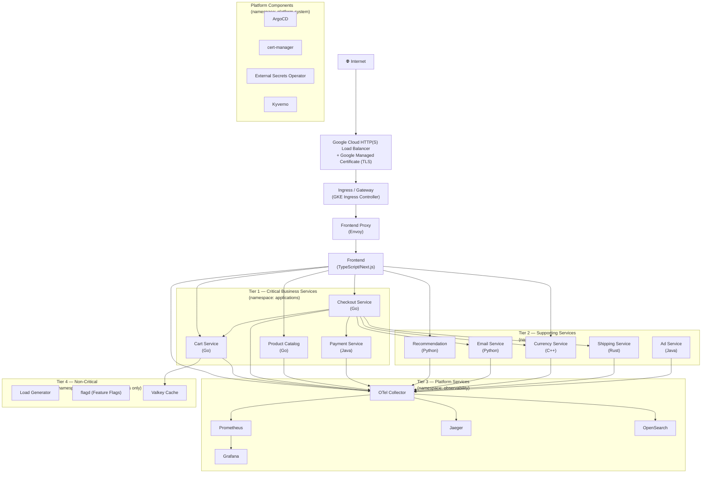

# Level 3 — Kubernetes Architecture

**Audience:** Kubernetes engineers, application engineers.

This diagram shows how workloads are organized inside the GKE cluster — namespaces, services, scheduling topology, and observability pipeline.

---

## Cluster Traffic Flow



---

## Namespace Strategy

| Namespace | Contents | Purpose |
|---|---|---|
| `argocd` | ArgoCD server, application controller | GitOps control plane |
| `platform-system` | cert-manager, ESO, Kyverno, metrics-server | Platform-level tooling |
| `observability` | Prometheus, Grafana, Loki, Jaeger, OpenSearch, OTel Collector | Full observability stack |
| `networking` | Istio control plane, Gateway API controllers | Service mesh and traffic management |
| `security` | Falco, policy agents, audit tooling | Security enforcement |
| `applications` | All OTel Demo microservices, load generator, flagd, Valkey | Business workloads |

---

## Node Pool Scheduling

| Workload | Target Pool | Reason |
|---|---|---|
| ArgoCD, cert-manager, ESO, Kyverno | `system-pool` | Platform-critical, must never be evicted |
| Prometheus, Grafana, OTel Collector | `system-pool` | Observability must survive app failures |
| OTel Demo microservices (Tier 1 & 2) | `general-pool` | Business workloads, autoscaling enabled |
| Load Generator, chaos jobs | `spot-pool` | Cost-optimized, tolerate interruption |

Scheduling uses `nodeSelector`, `tolerations`, and `affinity` rules — see [naming conventions](../design/naming-conventions.md) for label standards.

---

## Service Tier Classification

### Tier 1 — Critical Business Services
- **Services:** Frontend, Checkout, Cart, Payment, Product Catalog
- **SLA requirements:** Highest
- **Pod Disruption Budget:** `minAvailable: 1`
- **Priority Class:** `business-critical`
- **Anti-affinity:** Required — spread across nodes
- **Autoscaling:** HPA enabled

### Tier 2 — Supporting Services
- **Services:** Email, Recommendation, Currency, Shipping, Ad
- **SLA requirements:** Medium
- **Pod Disruption Budget:** Best-effort
- **Priority Class:** `business-standard`
- **Autoscaling:** HPA enabled

### Tier 3 — Platform Services (Observability)
- **Services:** OTel Collector, Prometheus, Grafana, Jaeger, OpenSearch
- **Priority Class:** `platform-critical`
- **Managed separately** from business services via GitOps

### Tier 4 — Non-Critical
- **Services:** Load Generator, flagd, Valkey
- **Runs on Spot nodes**
- **Priority Class:** `low-priority`
- **No PDB**

---

## OpenTelemetry Collector Pipeline

```
All Microservices (OTLP gRPC/HTTP)
         │
         ▼
  OTel Collector
         │
    ┌────┴────────────────────────┐
    ▼                             ▼                    ▼
Prometheus                     Jaeger           OpenSearch
(metrics)                    (traces)            (logs)
    │                                              │
    ▼                                              ▼
 Grafana                                       Grafana
(dashboards)                              (log exploration)

              Future:
              └──────► Cloud Monitoring
              └──────► Cloud Trace
```

---

## Network Policies (Zero Trust)

Network policies are enabled from Day 1. Key rules:
- Default: **deny all ingress and egress** per namespace
- Allow: specific service-to-service communication only
- Example: `frontend` can reach `cart`, `checkout`, `catalog` — **cannot** reach `payment` directly
- Ingress: Only from the Ingress controller namespace

---

*Previous: [Level 2 — Platform Architecture](platform-architecture.md)*
*Next: [Level 4 — CI/CD Flow](cicd-flow.md)*
