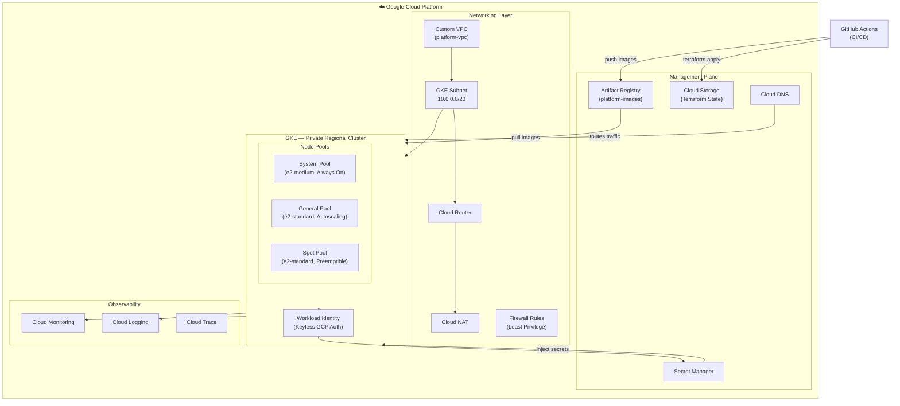

# Level 2 — Platform Architecture

**Audience:** Platform engineers, cloud architects.

This diagram shows the full GCP platform — how cloud services are organized, how they interact, and how the platform is structured for production operations.

---

## Diagram

---

## GCP Services Breakdown

### Networking
| Component | Resource | Purpose |
|---|---|---|
| VPC | `platform-vpc` | Isolated network for all resources |
| GKE Subnet | `gke-subnet` (`10.0.0.0/20`) | Node IPs |
| Pod Range | `10.10.0.0/16` | GKE alias IPs for pods |
| Service Range | `10.20.0.0/20` | GKE service cluster IPs |
| Cloud Router | `platform-router` | Dynamic route management for NAT |
| Cloud NAT | `platform-nat` | Outbound internet for private nodes |
| Firewall | Multiple rules | Least-privilege ingress/egress |

### Kubernetes Platform (GKE)
| Component | Description |
|---|---|
| Cluster type | Private, Regional (`asia-south1`) |
| Release channel | `REGULAR` — predictable managed upgrades |
| System Pool | Runs: ArgoCD, cert-manager, Prometheus, Grafana, Istio control plane |
| General Pool | Runs: OTel Demo business microservices |
| Spot Pool | Runs: Load generator, chaos jobs, batch workloads |
| Workload Identity | All pods authenticate to GCP using K8s service accounts — no JSON keys |
| Dataplane V2 | eBPF networking for better observability and policy enforcement |
| Network Policies | Zero-trust pod-to-pod communication |

### Management
| Component | Purpose |
|---|---|
| Artifact Registry | Private container image registry |
| Secret Manager | Secrets injection via External Secrets Operator |
| Cloud Storage | Remote Terraform state, GKE backups |
| Cloud DNS | Managed DNS for environment hostnames |

### Observability
| Component | Purpose |
|---|---|
| Cloud Monitoring | Node, cluster, and infrastructure metrics |
| Cloud Logging | Cluster audit logs, system logs |
| Cloud Trace | Distributed tracing (alongside Jaeger) |
| Prometheus + Grafana | Application metrics and dashboards (in-cluster) |

---

## Environment Strategy

| Environment | Cluster | Namespace Prefix | Domain |
|---|---|---|---|
| dev | `otel-dev-gke` | `dev-*` | `dev.shop.platform.example.com` |
| stage | `otel-stage-gke` | `stage-*` | `stage.shop.platform.example.com` |
| prod | `otel-prod-gke` | `prod-*` | `shop.platform.example.com` |

> For portfolio cost management, all environments initially share a single GCP project with namespace separation. The Terraform code supports multi-project expansion.

---

*Previous: [Level 1 — System Context](system-context.md)*
*Next: [Level 3 — Kubernetes Architecture](kubernetes-architecture.md)*
