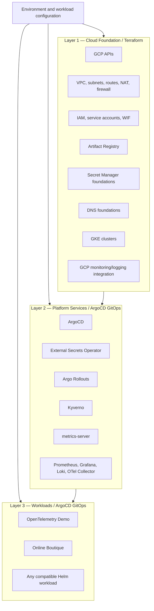
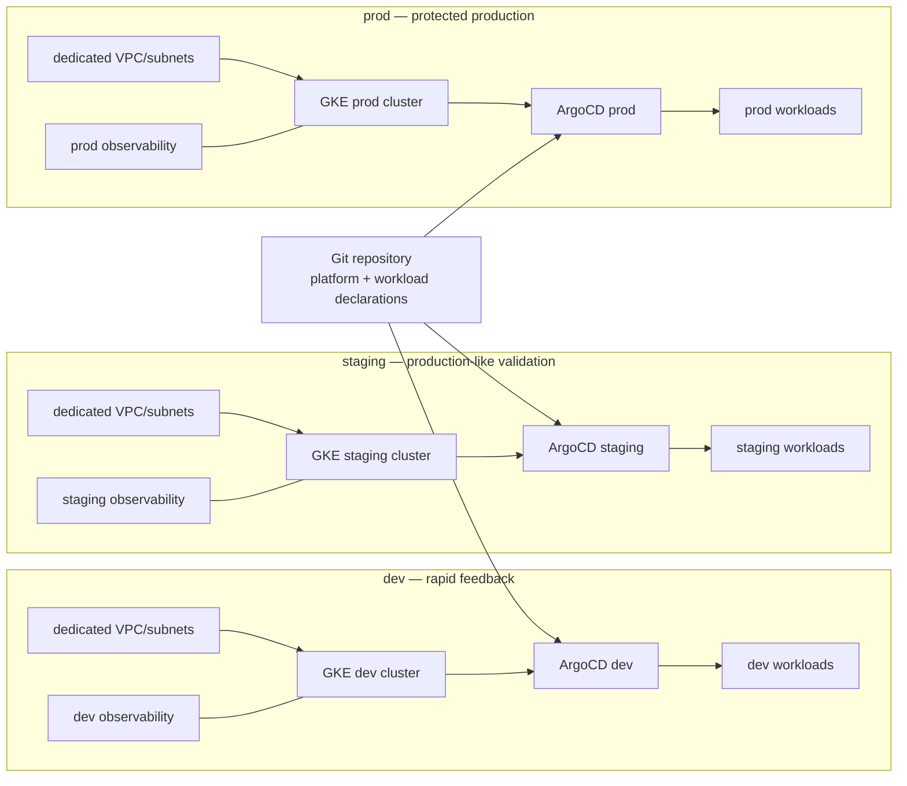
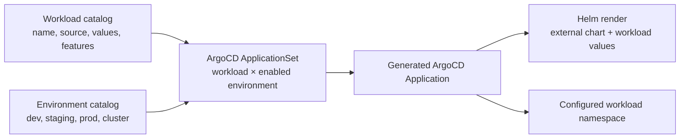
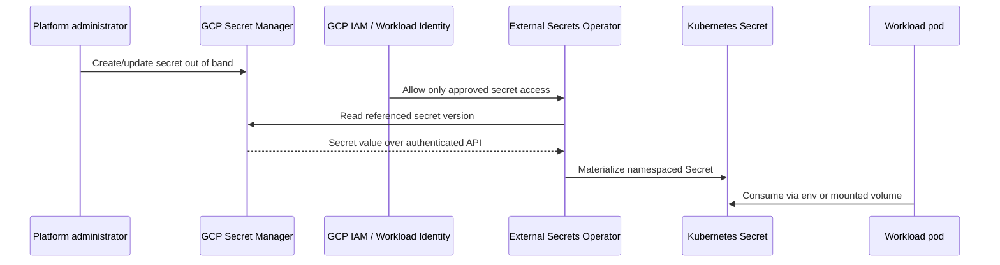
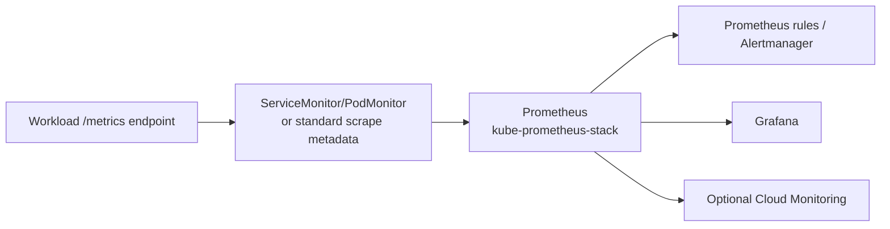
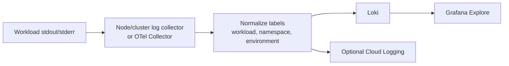
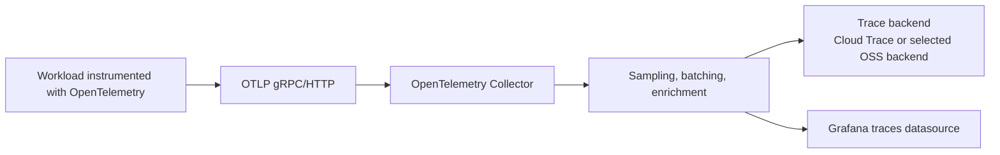
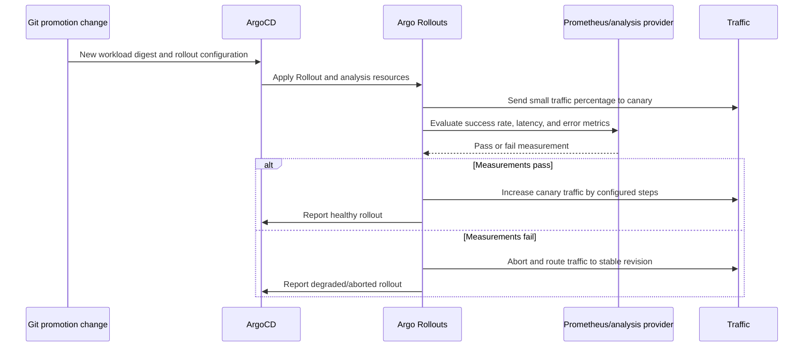

# Reusable GCP DevSecOps Platform Architecture

**Status:** Target architecture  
**Implementation status:** Design only; this document does not authorize or perform the refactor  
**Canonical environments:** `dev`, `staging`, `prod`

## 1. Purpose

This repository is being transformed into a reusable GCP DevSecOps platform for arbitrary Helm-based microservice workloads.

The platform must be able to deploy:

- the OpenTelemetry Demo;
- Google's Online Boutique;
- an internally developed microservice system; or
- another externally hosted or repository-owned Helm chart.

Changing the workload must not require rewriting Terraform modules, cluster infrastructure, ArgoCD platform configuration, security policy, or the observability stack.

The intended onboarding model is:

```text
platform foundation
+ platform services
+ workload chart
+ small workload configuration
= deployed application
```

The OpenTelemetry Demo is an example workload, not a platform dependency or architectural assumption.

## 2. Architectural principles

1. **Infrastructure and Kubernetes have separate owners.** Terraform provisions GCP and bootstraps GitOps. ArgoCD reconciles normal Kubernetes state.
2. **Configuration selects workloads.** Workload identity, chart source, environments, values, exposure, secrets, observability, and delivery strategy are data.
3. **Platform components are workload-independent.** Shared security and observability integrate through Kubernetes and OpenTelemetry standards.
4. **Git is the desired-state source of truth.** Changes are reviewed, committed, reconciled, and auditable.
5. **Promotion moves the same artifact.** Environments receive an immutable image digest that has already passed the required gates; images are not rebuilt for promotion.
6. **Secure defaults, explicit exceptions.** Policies are strict by default, with scoped, owned, expiring exceptions where necessary.
7. **Deployment strategy is opt-in.** Ordinary Kubernetes Deployments are the default. Argo Rollouts are available for workloads that explicitly support progressive delivery.
8. **Secrets are references, never values.** Secret Manager and External Secrets provide runtime secret material without committing credentials.

## 3. Logical architecture layers



### Layer 1 — Cloud Foundation

Layer 1 is reusable Terraform-managed infrastructure. It creates the cloud prerequisites and the Kubernetes clusters, but it does not manage ordinary workload Deployments, Services, ConfigMaps, Secrets, Rollouts, or application Helm releases.

Layer 1 includes:

- required GCP APIs;
- VPC networks and environment-specific subnets;
- private GKE node networking and secondary ranges;
- Cloud Router, Cloud NAT, routes, and controlled firewall rules;
- Artifact Registry repositories and least-privilege read/write IAM;
- service accounts and Workload Identity for GKE workloads and platform controllers;
- GitHub Workload Identity Federation for CI;
- Secret Manager integration foundations and IAM boundaries;
- Cloud DNS zones/records or the inputs required by the chosen Kubernetes exposure mechanism;
- GKE clusters, node pools, autoscaling, release channels, security settings, and workload identity;
- GCP Cloud Monitoring/Logging integration where it provides value in addition to in-cluster telemetry.

Terraform inputs include project IDs, regions/zones, environment, cluster names, CIDRs, labels, sizing, repository identities, state prefixes, and feature flags. Reusable modules must not embed any workload name, chart, namespace, hostname, image repository, or environment-specific constant.

### Layer 2 — Platform Services

Layer 2 is installed and reconciled by ArgoCD. These services provide capabilities to all workloads in an environment:

- **ArgoCD:** GitOps controller, Projects, ApplicationSets, sync policy, health checks, and notifications.
- **External Secrets Operator:** reads approved Secret Manager references using Workload Identity and materializes Kubernetes Secrets at runtime.
- **Argo Rollouts:** optional progressive delivery controller and analysis support.
- **Kyverno:** reusable admission and mutation/validation policies for workload security and operational standards.
- **metrics-server:** resource metrics for HPA and operational tooling.
- **Prometheus:** platform metrics collection and alert evaluation, normally from kube-prometheus-stack.
- **Grafana:** metrics, logs, and traces visualization with platform-owned datasources and reusable dashboards.
- **Loki:** centralized Kubernetes log storage and querying.
- **OpenTelemetry Collector:** standard OTLP gateway/collector for traces, logs, and optional metrics routing.
- **Supporting components:** only components required by the selected stack, such as kube-state-metrics, node exporters, admission webhooks, storage classes, Gateway API controllers, or log/telemetry agents.

Platform services are deployed separately from workloads. A workload may opt into an integration, but it does not install or own the shared platform stack.

### Layer 3 — Workloads

Layer 3 contains arbitrary Helm-based applications. A workload may use:

- an external Helm repository;
- a chart stored in its own Git repository;
- a chart stored in this repository under an explicitly workload-owned path; or
- a compatible chart plus environment-specific values.

The platform consumes the workload contract and generates ArgoCD Applications. It does not inspect or assume the internal microservice names of the chart.

## 4. dev/staging/prod topology

The default target topology is one isolated GKE cluster per environment. Each environment has its own cluster, Kubernetes control plane, node pools, GitOps reconciliation boundary, workload namespaces, secrets, and observability retention policy. Separate GCP projects are preferred where organizational isolation and billing boundaries justify the cost; a shared GCP project remains possible when project-level inputs and IAM boundaries are explicit.



### Environment characteristics

| Environment | Purpose | Delivery policy | Typical platform posture |
|---|---|---|---|
| `dev` | Fast feedback and integration testing | Automatic deployment after required CI gates | Lower cost, smaller capacity, relaxed non-production policy exceptions, short retention |
| `staging` | Production-like validation and release verification | Promotion after dev validation; automatic or approval-gated sync | Production-like policy, capacity, topology, observability, and progressive-delivery tests |
| `prod` | Protected live service | Explicit promotion approval and protected Git change | Strongest policy, HA, durable retention, restricted access, controlled rollout and rollback |

Environment differences are represented in environment configuration and workload overlays. They must not be duplicated by copying platform Terraform or Application manifests.

## 5. Workload contract

The workload contract is the interface between a workload owner and the platform. The exact serialization format may be YAML, JSON, or a generated custom resource, but it must be versioned, schema-validated, and expressive enough to generate an ArgoCD Application or ApplicationSet element.

An illustrative shape is:

```yaml
apiVersion: platform.example.io/v1alpha1
kind: Workload
metadata:
  name: example-store
spec:
  namespace: example-store

  source:
    repoURL: https://example.invalid/charts
    chart: example-store
    targetRevision: 1.2.3
    # For a Git-owned chart, use repoURL + path instead of chart.
    path: null

  values:
    common:
      - workloads/example-store/values/common.yaml
    dev:
      - workloads/example-store/values/dev.yaml
    staging:
      - workloads/example-store/values/staging.yaml
    prod:
      - workloads/example-store/values/prod.yaml

  destinations:
    - environment: dev
    - environment: staging
    - environment: prod

  features:
    progressiveDelivery: false
    observability: true
    externalSecrets: true

  network:
    hostname: store.example.invalid
    exposure: gateway

  delivery:
    strategy: deployment
    # strategy: rollout is opt-in and requires chart compatibility.

  secrets:
    - name: store-runtime
      secretStoreRef: store-secret-store
      keys:
        - api-key
```

### Contract semantics

| Contract area | Meaning |
|---|---|
| `name` | Stable workload identifier used for generated Application names, labels, metrics, and policy scope. |
| `namespace` | Workload namespace or namespace template. The platform validates and creates it from configuration; it is not embedded in shared platform manifests. |
| `source` | External Helm repository/chart/version or Git repository/path/version. External charts remain external unless there is a strong reason to vendor them. |
| `values` | Common and environment-specific values references. Values remain workload-owned; the platform only supplies standard integration values where explicitly agreed. |
| `destinations` | Environments and clusters where the workload is enabled. Absence from an environment means no generated Application there. |
| `features.progressiveDelivery` | Enables Rollouts resources/behavior only when the chart and workload support it. |
| `features.observability` | Enables standard telemetry integration such as OTLP environment variables, scrape metadata, dashboards, and alerts. |
| `features.externalSecrets` | Enables the workload's references to approved External Secrets resources without storing secret values in Git. |
| `network` | Exposure mode and hostname. The platform supplies Gateway/Ingress integration; the workload owns application Services and ports. |
| `delivery.strategy` | `deployment` by default; `rollout` only when compatible and explicitly selected. |
| `secrets` | References and access intent, never secret values. Environment-specific secret names and stores are resolved by configuration. |

Additional fields may be added for resource profiles, service accounts, HPA, PDB, topology, policy exceptions, dependencies, or ownership metadata. The contract should remain small and avoid reproducing every chart value.

### ApplicationSet implementation model

The preferred implementation is a generator that combines a workload catalog with an environment/cluster catalog:



The generator may be a list, Git, matrix, pull-request, or plugin generator depending on repository organization. The important property is that repeated Applications are generated from data rather than copied manually.

Generated Applications should include:

- a constrained ArgoCD Project;
- source repository/chart/path and pinned revision;
- common plus environment values;
- destination cluster and namespace;
- intentional sync policy and retry behavior;
- sync waves after required platform services;
- health checks and ignore differences only where justified;
- labels identifying workload, environment, owner, and delivery strategy.

## 6. Ownership boundary

The platform must enforce a clear boundary between shared capabilities and application behavior.

| Concern | Platform-owned | Workload-owned | Contract/interface |
|---|---|---|---|
| GCP projects, VPC, GKE, IAM, Artifact Registry | Yes | No | Terraform inputs and outputs |
| ArgoCD installation and Projects | Yes | No | GitOps bootstrap |
| Namespace creation and baseline quotas/policies | Yes, from configuration | May request namespace metadata | `namespace`, tenant, resource profile |
| Helm chart templates | No, except shared platform charts | Yes | `source` |
| Application values | Standard defaults only | Yes | `values.common` and environment values |
| Deployments or compatible Rollouts | Controller and policy only | Chart/workload implementation | `delivery.strategy`, chart capability |
| Service ports and health endpoints | Policy validates them | Yes | Helm chart values/rendered manifests |
| Ingress/Gateway integration | Shared Gateway/controller and policy | Routes and hostname request | `network` |
| Secrets | Secret Manager, ESO, IAM, stores | Secret references and consumption | `secrets`, ExternalSecret manifests/values |
| Network policies | Baseline defaults and shared exceptions | App-specific communication rules | Declared dependencies or workload manifests |
| Security context/resources/probes | Admission policy and minimum standards | Concrete pod values | Rendered workload manifests |
| Prometheus/Grafana/Loki/OTel Collector | Yes | No | Metrics/logs/traces standards |
| Dashboards and alerts | Platform dashboards and reusable service views | Workload-specific dashboards/alerts | Labels, service names, metric conventions |
| Application business logic | No | Yes | Workload chart/image |

The platform must not contain assumptions such as `frontend`, `cart`, `checkout`, `otel-demo`, `online-boutique`, or any other application service name.

## 7. Promotion model

Promotion is configuration promotion of an immutable artifact, not a rebuild.

```mermaid
flowchart LR
    PR["Workload source PR"] --> TEST["CI: tests, lint, chart render"]
    TEST --> BUILD["Build image"]
    BUILD --> SCAN["Scan + SBOM + provenance"]
    SCAN --> SIGN["Sign image digest"]
    SIGN --> PUSH["Artifact Registry\nimage@sha256:digest"]
    PUSH --> DEVPR["Promote digest to dev config"]
    DEVPR --> DVERIFY["Dev verification"]
    DVERIFY --> STGPR["Promote same digest to staging"]
    STGPR --> SVERIFY["Staging tests / analysis"]
    SVERIFY --> PRODPR["Approved production promotion"]
    PRODPR --> PROD["ArgoCD prod sync"]
```



- CI builds and publishes immutable image digests.
- A Git change selects the digest for `dev`.
- Successful dev verification promotes the same digest to `staging`.
- Staging validation and required approvals promote the same digest to `prod`.
- Chart versions and values revisions are also pinned and promoted through reviewed Git changes.
- Environment policy can require approval, change windows, analysis results, or release metadata before sync.

## 8. CI and CD responsibilities

### CI responsibilities — GitHub Actions

CI validates and produces artifacts. It may authenticate to GCP using GitHub Workload Identity Federation, never a long-lived service-account key.

CI responsibilities include:

- source checkout, dependency checks, unit/integration tests, and language-specific linting;
- Helm lint and template rendering for each declared workload/environment combination;
- YAML/schema/contract validation;
- Terraform format/validate and optional TFLint/Checkov validation for infrastructure changes;
- Kubernetes client-side dry-run and policy tests against rendered manifests;
- container build with reproducible metadata and immutable tags/digests;
- vulnerability scanning with defined environment-independent gates;
- SBOM generation and retention;
- image signing and provenance attestation where supported;
- publishing the image and security metadata to approved stores;
- proposing a GitOps promotion change with the image digest, chart revision, or values revision.

CI does not directly mutate running Kubernetes workloads or bypass ArgoCD.

### CD responsibilities — ArgoCD and controllers

CD consumes Git as desired state and reconciles it:

- ArgoCD detects workload/platform Git changes;
- ApplicationSets generate Applications for enabled workload/environment pairs;
- Helm renders the pinned chart and values;
- Kyverno validates or mutates resources at admission;
- External Secrets resolves runtime secret references;
- Argo Rollouts performs canary/blue-green progression when enabled;
- Prometheus/analysis providers determine rollout health where configured;
- ArgoCD reports sync, health, drift, and failure status.

CD does not build images, generate source code, or store secret values.

## 9. Secret flow



Rules:

- Secret values never enter Git, Terraform variables committed to the repository, Helm values, CI logs, or image layers.
- Terraform creates IAM/service-account foundations and, where appropriate, Secret Manager secret containers and access bindings; it does not manage secret payload values.
- External Secrets is the runtime synchronization mechanism.
- Workload contracts reference secret stores, secret names, and keys; they do not contain values.
- Access is environment- and workload-scoped where practical.
- Secret rotation is performed in Secret Manager and propagated by ESO; workloads must support restart/reload behavior as appropriate.

## 10. Observability flows

Observability is platform-level and workload-independent. Workloads integrate using standard protocols, labels, and resource attributes.

### Metrics flow



- A workload exposes Prometheus-compatible metrics or emits metrics through OTLP.
- The platform supplies scrape discovery, retention, recording rules, alerting, and Grafana datasources.
- Workload labels must identify service, workload, namespace, environment, and cluster without hardcoded OTel service names.

### Logs flow



- Workloads write structured logs to stdout/stderr by default.
- The platform collects, normalizes, labels, routes, retains, and protects logs.
- Workload-specific log parsing is optional and owned by the workload integration, not embedded in the platform default.

### Traces flow



- Workloads use standard OpenTelemetry SDK conventions and OTLP endpoints.
- The platform configures collector receivers, processors, exporters, sampling, resource attributes, and access controls.
- Workload configuration may enable or tune telemetry, but does not install a collector or hardcode a specific backend implementation.

## 11. Image supply-chain flow

```mermaid
flowchart TD
    SRC["Source commit"] --> STATIC["Lint, tests, dependency/SAST checks"]
    STATIC --> BUILD["Build immutable image"]
    BUILD --> SBOM["Generate SBOM"]
    BUILD --> PROV["Generate provenance"]
    SBOM --> VULN["Vulnerability scan"]
    VULN --> DECIDE{ "Policy gate" }
    PROV --> DECIDE
    DECIDE -->|pass| SIGN["Sign image digest"]
    DECIDE -->|fail| STOP["Reject artifact"]
    SIGN --> AR["Artifact Registry"]
    AR --> PROMOTE["Promote digest through Git"]
    PROMOTE --> ADMIT["Kyverno / GKE admission verification"]
    ADMIT --> DEPLOY["ArgoCD deploys"]
```

- Image references used for promotion and deployment should be digest-pinned where practical.
- Tags may aid discovery, but a tag alone is not the security identity of a production image.
- SBOMs, scan results, signatures, and provenance are associated with the digest and retained as release evidence.
- Kyverno can verify signatures/attestations; GKE Binary Authorization may be added when its policy model fits the environment. The two controls must have an intentional, non-conflicting responsibility split.
- Development may use warnings or lower thresholds for experimentation, but production admission and promotion policy is stricter.

## 12. Rollback flow

```mermaid
flowchart LR
    DETECT["Alert, failed rollout, or operator decision"] --> CHOOSE["Choose last known-good\nGit revision + image digest"]
    CHOOSE --> PR["Revert or create reviewed Git change"]
    PR --> ARGO["ArgoCD detects desired state"]
    ARGO --> STRAT{ "Delivery strategy" }
    STRAT -->|Deployment| ROLL["Kubernetes rolling replacement"]
    STRAT -->|Rollout| ABORT["Argo Rollouts abort/promote stable revision"]
    ROLL --> HEALTH["Health and telemetry verification"]
    ABORT --> HEALTH
```

- The normal rollback is a Git revert to a known-good chart/value/image digest combination.
- Argo Rollouts can abort an active canary or restore the stable ReplicaSet before a Git revert is completed.
- Emergency operational actions must be followed by reconciliation with Git so the repository remains authoritative.
- Rollback does not delete infrastructure or secrets.

## 13. Progressive-delivery flow



Progressive delivery is optional per workload. A chart must either:

- natively render an Argo `Rollout` and compatible Services; or
- provide a documented, tested integration where platform-owned wrapper resources can control the workload safely.

The platform must not blindly replace every chart's `Deployment` with a `Rollout`; many charts make assumptions about resource names, selectors, hooks, or controllers. Ordinary Deployments remain the compatible default.

## 14. How a workload is swapped

Replacing the OpenTelemetry Demo with Online Boutique, or with an internal application, follows this process:

1. Create or reference the replacement Helm chart and validate its chart contract.
2. Add one workload declaration containing its source, chart/path, pinned revision, namespace, enabled environments, values references, exposure, secret references, observability option, and delivery strategy.
3. Add workload-owned common and environment values. Do not edit platform Terraform, platform security policies, or observability stack configuration to name the new application.
4. Ensure the chart emits standard Kubernetes resources: Deployments or compatible Rollouts, Services, probes, resource requests/limits, and non-privileged security settings.
5. Run CI rendering, schema, security-policy, image, SBOM, signature, and environment validation.
6. Promote the workload to `dev`, validate telemetry and secret resolution, then promote the same artifact to `staging` and `prod`.
7. Remove the old workload declaration after its Applications are intentionally retired through GitOps.

The infrastructure and platform services remain unchanged. Only workload-owned files and catalog entries change.

## 15. Required platform defaults for workloads

The platform should validate or require the following unless a reviewed exception exists:

- a supported namespace selected from configuration;
- a non-root `securityContext`, dropped capabilities, and an appropriate seccomp profile;
- CPU/memory requests and limits;
- readiness and liveness probes where the application supports them;
- a Service with explicit ports for network exposure;
- NetworkPolicies where namespace isolation and service communication require them;
- PodDisruptionBudgets for replicated, disruption-sensitive services;
- immutable image references or an admission-enforced equivalent;
- standard labels for workload, component, environment, owner, and version;
- standard OpenTelemetry resource attributes and OTLP configuration when observability is enabled;
- no embedded credentials, host-path access, privileged containers, or unapproved registries.

These are platform policies and interfaces. The actual application endpoints, ports, replica counts, dependencies, and business behavior remain workload-owned values.

## 16. Implementation boundary summary

```text
Terraform:
  cloud foundation + IAM + cluster creation + minimal ArgoCD handoff

ArgoCD platform applications:
  controllers + security + observability + shared networking capabilities

Workload declarations and charts:
  application source + chart + values + environment enablement
  + workload-specific resources and integrations

GitHub Actions:
  validate + build + scan + SBOM + sign + publish + propose promotion

ArgoCD / Kubernetes controllers:
  reconcile + admit + resolve secrets + deploy + observe + progress/abort
```

The final proof of reusability is onboarding a second workload without changing the first three categories of shared platform implementation: Terraform modules, platform GitOps applications, or generic security/observability configuration.

