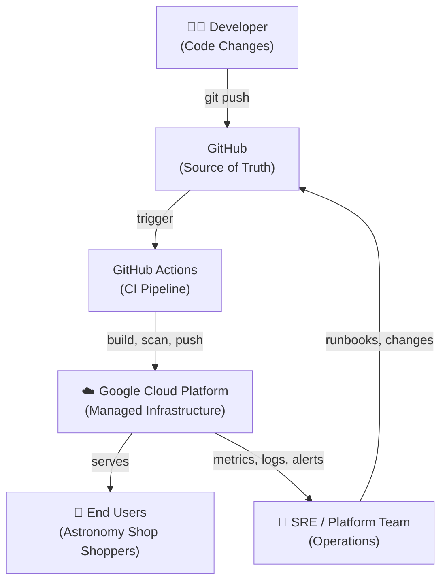

# Level 1 — System Context

**Audience:** Recruiters, engineering managers, non-technical stakeholders.

This diagram answers a single question: *Who interacts with this system and what does it do at the highest level?*

---

## Diagram

---

## Description

| Actor | Role |
|---|---|
| **Developer** | Writes code, pushes to GitHub |
| **GitHub** | Stores all source code and platform configuration |
| **GitHub Actions** | Runs CI pipelines — builds images, runs tests, scans for vulnerabilities, pushes to Artifact Registry |
| **Google Cloud Platform** | Hosts all infrastructure — GKE cluster, networking, secrets, monitoring |
| **End Users** | Access the OpenTelemetry Demo (Astronomy Shop) through a Google Cloud Load Balancer |
| **SRE / Platform Team** | Monitors platform health, responds to incidents, performs planned changes |

---

## Key Relationships

- **GitHub is the single source of truth** — both application code and infrastructure configuration live here.
- **No human manually touches GCP infrastructure** after initial bootstrapping. All changes flow through CI/CD and GitOps.
- **Developers are insulated from cloud complexity** — they push code and the platform handles everything else.
- **SRE feeds learnings back into Git** — runbooks, alert tuning, capacity changes are all committed as code.

---

*Next: [Level 2 — Platform Architecture](platform-architecture.md)*
