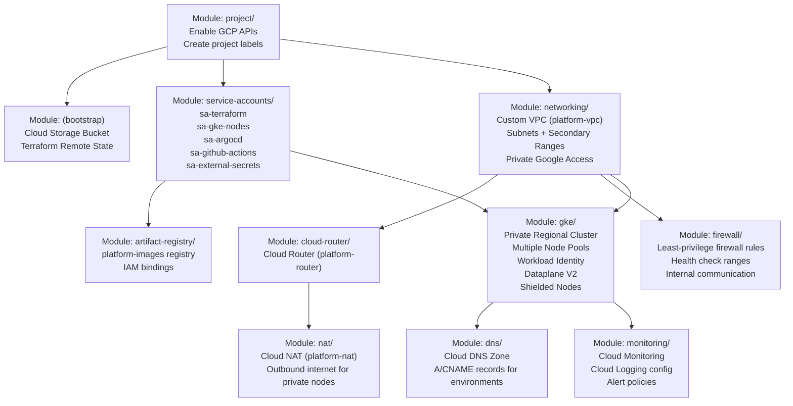

# Level 5 — Terraform Dependency Graph

**Audience:** Cloud engineers, infrastructure engineers.

This diagram shows the dependency order of Terraform modules and why the networking layer must be provisioned before Kubernetes, which must be provisioned before applications.

---

## Module Dependency Graph



---

## Module Descriptions

| Module | Phase | Description |
|---|---|---|
| `project/` | 2 | Enable required GCP APIs, configure project-level settings and labels |
| `(bootstrap)` | 2 | Manual one-time step: create GCS bucket for Terraform remote state |
| `service-accounts/` | 2 | Create all service accounts with least-privilege IAM bindings |
| `networking/` | 2 | Custom VPC, subnets with primary + secondary IP ranges, Private Google Access |
| `cloud-router/` | 2 | Cloud Router for dynamic route management |
| `nat/` | 2 | Cloud NAT for private node outbound internet access |
| `firewall/` | 2 | Firewall rules: internal comms, health checks, IAP SSH, deny-all default |
| `artifact-registry/` | 5/6 | Private Docker registry, IAM bindings for GKE nodes and GitHub Actions |
| `gke/` | 3 | Private regional GKE cluster, node pools, Workload Identity, Dataplane V2 |
| `dns/` | 5 | Cloud DNS managed zone, environment-specific records |
| `monitoring/` | 8 | Cloud Monitoring dashboards, Cloud Logging sinks, alert notification channels |

---

## GKE Module Internal Structure

The `gke/` module is the most complex. It will be split into focused files:

```
terraform/modules/gke/
├── cluster.tf           # google_container_cluster resource
├── nodepools.tf         # system, general, and spot node pools
├── workload_identity.tf # Workload Identity bindings
├── logging.tf           # Cloud Logging configuration
├── monitoring.tf        # Cloud Monitoring configuration
├── autoscaling.tf       # Cluster Autoscaler settings
├── variables.tf         # All input variables
├── outputs.tf           # Exported values (cluster name, endpoint, etc.)
└── README.md            # Module documentation
```

---

## Environment Deployment Flow

Each environment uses the same modules with different variable files:

```
terraform/environments/dev/
├── main.tf          # Module calls
├── variables.tf     # Variable declarations
├── terraform.tfvars # Dev-specific values (node count, machine types, etc.)
└── backend.tf       # Remote state configuration
```

```
Terraform Apply (dev)
        │
        ├── module.networking (VPC, subnets for dev)
        ├── module.gke       (otel-dev-gke cluster)
        └── module.dns       (dev.shop.platform.example.com)
```

---

## Remote State Strategy

All Terraform state is stored remotely in Cloud Storage:

```
gs://platform-tf-state/
├── dev/terraform.tfstate
├── stage/terraform.tfstate
└── prod/terraform.tfstate
```

State bucket configuration:
- **Versioning:** Enabled
- **Uniform bucket-level access:** Enabled
- **Public access prevention:** Enforced
- **Lifecycle:** Delete old versions after 90 days

---

## Provisioning Order

This is the safe order to run `terraform apply`:

```
Phase 2 (Manual bootstrap):
  1. Create GCS state bucket (gcloud or manual)
  2. Apply project/ module (APIs, labels)
  3. Apply service-accounts/ module
  4. Apply networking/ module
  5. Apply cloud-router/ module
  6. Apply nat/ module
  7. Apply firewall/ module

Phase 3:
  8. Apply gke/ module

Phase 5:
  9. Apply artifact-registry/ module
  10. Apply dns/ module

Phase 8:
  11. Apply monitoring/ module
```

---

*Previous: [Level 4 — CI/CD Flow](cicd-flow.md)*
*Back to: [Root README](../../README.md)*
