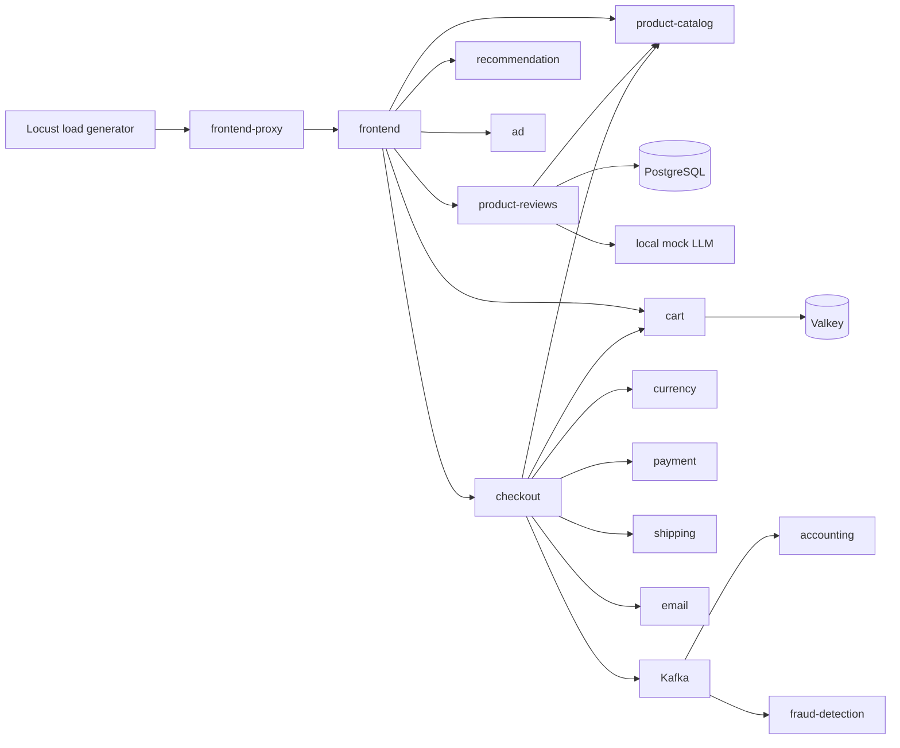

# OpenTelemetry Demo dev observability runbook

This runbook records the source and rendered-manifest baseline for the dev
workload. It is deliberately not an Observed Telemetry Report: that report,
dashboard queries, alert rules, and thresholds must be produced only after the
running dev cluster has generated telemetry.

## Version and deployment baseline

| Item | Verified value |
| --- | --- |
| OpenTelemetry Demo application | `2.2.0` |
| Helm chart | `opentelemetry-demo` `0.40.9` |
| Deployment method | Argo CD ApplicationSet renders the external Helm chart using the values in this repository. |
| Dev namespace | `opentelemetry-demo-dev` |
| Shared Collector chart / image | `opentelemetry-collector` `0.169.0` / collector-contrib `0.158.0` |
| Metrics backend | Shared Prometheus |
| Trace backend | Shared Tempo, queried through Grafana |
| Logs backend | Shared Loki |

The chart is a Demo 2.2.0 release, not a 3.x release. The load generator is
therefore the upstream Python Locust implementation; no k6 assumptions or 3.x
`demo.*` attribute assumptions are valid here.

## Rendered dev inventory

The following components are enabled in the chart rendered with
`values/base.yaml` and `values/dev.yaml`. The list is based on the actual
render, while the role and implementation come from the matching 2.2.0 source.

| Component | Implementation | Role and dependency relevance |
| --- | --- | --- |
| `load-generator` | Python / Locust | Synthetic HTTP user traffic. Sends requests to `frontend-proxy` and OTLP telemetry to the shared Collector. |
| `frontend-proxy` | Envoy | Public in-cluster HTTP entry point; routes web, API, Locust UI, and flagd-ui traffic. |
| `frontend` | Next.js / TypeScript | Storefront and API facade for browse, cart, checkout, recommendation, review, and AI-assistant routes. |
| `product-catalog` | Go | Product data used by browse and checkout flows. |
| `product-reviews` | Python | Product-review data and summaries; enabled in dev for the Locust review route. |
| `llm` | Python local mock | Produces review summaries for the AI-assistant route; its upstream README says it is not OTel-instrumented. |
| `recommendation` | Python | Product recommendations. |
| `ad` | Java | Context-key advertisement service. |
| `quote` | PHP | Quote service used by the storefront. |
| `image-provider` | NGINX | Static product images. |
| `cart` | .NET | Stores user carts in `valkey-cart`. |
| `checkout` | Go | Orchestrates cart, product, currency, payment, shipping, email, and Kafka work. |
| `currency` | C++ | Currency conversion. |
| `payment` | Node.js | Charges an order; reads the `paymentFailure` feature flag. |
| `shipping` | Rust | Shipping quotation and order shipment. |
| `email` | Ruby | Order-confirmation email handling. |
| `kafka` | Kafka | Order events emitted by checkout. |
| `accounting` | .NET | Kafka order-event consumer. |
| `fraud-detection` | Java | Kafka order-event consumer that returns suspected fraud cases. |
| `postgresql` | PostgreSQL | Product-catalog and product-review persistence. |
| `valkey-cart` | Valkey | Cart persistence. |
| `flagd` + `flagd-ui` | flagd + Demo UI sidecar | Feature-flag evaluation and the flag configuration API; both containers run in the rendered `flagd` Deployment. |

The upstream Demo's embedded Collector, Prometheus, Grafana, Jaeger, and
OpenSearch are intentionally disabled. They must remain disabled because this
platform already supplies shared Collector, Prometheus, Grafana, Tempo, and
Loki services.

## Verified request and dependency paths

The Locust source targets `http://frontend-proxy:8080`. Its enabled HTTP tasks
have weights: product browse 10; recommendation, advertising, and cart view 3
each; product reviews and add-to-cart 2 each; homepage, AI-assistant, single
checkout, and multi-item checkout 1 each. Its homepage flood task has weight 5
but sends no requests while `loadGeneratorFloodHomepage` remains `off`.



The source adds a root span for each Locust task, enables Python logging
instrumentation, and exports traces, metrics, and logs via OTLP. Browser
traffic is explicitly disabled in dev, so Playwright traffic is absent. The
configured profile starts 50 HTTP users at 5 users per second. It uses the
general dev pool rather than the zero-sized spot pool so a spot-capacity
shortage cannot suppress all synthetic traffic.

## Existing telemetry pipeline

```text
Demo services and Locust
  -> OTLP (gRPC or HTTP)
  -> shared otel-collector in observability
  -> metrics: Prometheus exporter -> shared Prometheus scrape
  -> traces: OTLP exporter -> shared Tempo
  -> logs: OTLP/HTTP exporter -> shared Loki
```

The Collector applies memory limiting, Kubernetes attribute enrichment, and
batching to all three signals. No Collector or backend change is needed before
the first live discovery.

## Failure scenario decision

The Demo 2.2.0 flag configuration includes built-in LLM, product-catalog,
recommendation-cache, ad, Kafka, cart, payment, load-generator, image, cart
readiness, and email-memory scenarios. The selected demonstration is
`paymentFailure` at `100%`:

- It is active only during checkout traffic and is easy to understand.
- The payment source throws a payment-charge error before the transaction is
  recorded, giving the checkout path a clear degradation.
- It is reversible without application code or Kubernetes mutation.
- `scripts/otel-demo-observability.sh` first saves the complete live flagd
  configuration with mode `0600`, then restores that exact configuration.

## Live-discovery gate and sequence

Do not create workload dashboards, PromQL, or alert thresholds until each step
below has completed successfully:

1. Publish the reviewed repository revision to the remote `main` branch used
   by Argo CD, then manually perform the reviewed Terraform apply for dev.
2. Run `scripts/wait-for-gitops-convergence.sh --environment dev --timeout 1800`.
3. Run `scripts/otel-demo-observability.sh preflight --environment dev` and
   verify Locust logs show generated traffic.
4. Inspect actual Prometheus metric names, types, and labels; inspect Tempo
   traces for a normal checkout; inspect Loki logs and their trace correlation.
5. Record those findings as the Observed Telemetry Report, then create only
   the small workload-owned dashboards and alert rules supported by those
   findings.
6. Establish healthy and degraded baselines, run the payment-failure helper,
   validate the resulting signals and trace, and restore the saved flag state.

The runtime helpers use read-only Kubernetes queries except for the
user-selected flagd configuration write during the failure demonstration. They
never run Terraform apply or destroy, Helm operations, or destructive
Kubernetes commands.
