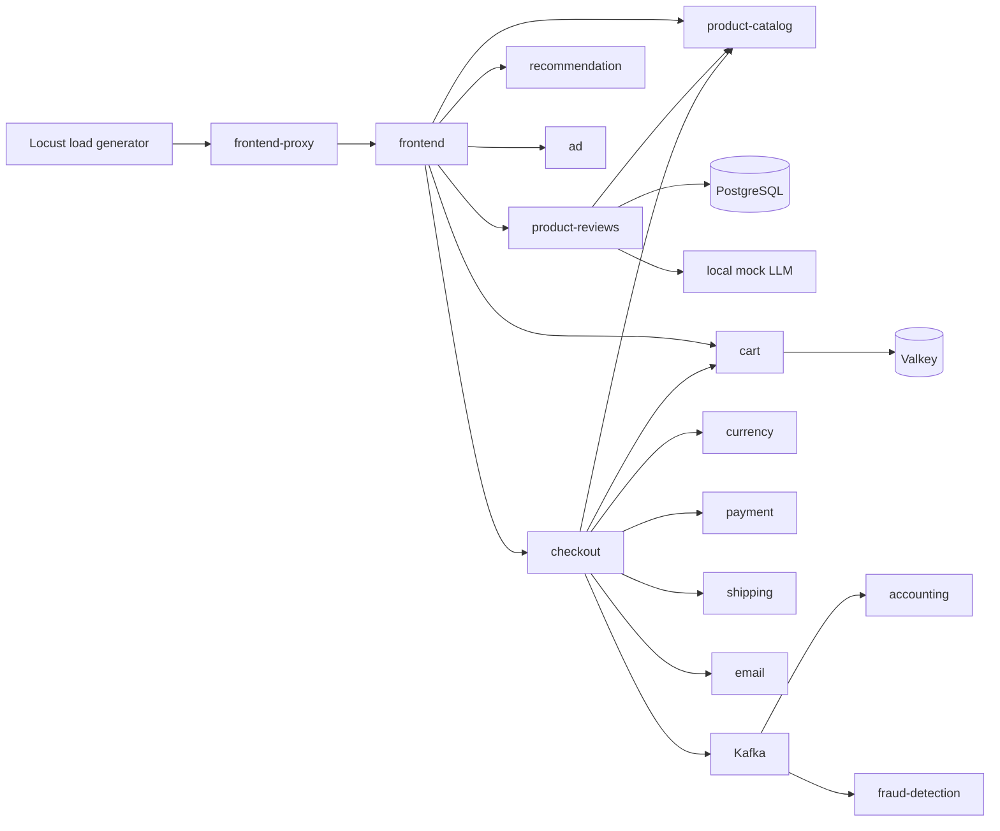

# OpenTelemetry Demo dev observability runbook

This runbook records the source, rendered-manifest baseline, and the completed
Observed Telemetry Report for the dev workload. Dashboard queries, alert rules,
and thresholds below were selected only after collecting data from the running
cluster.

## Version and deployment baseline

| Item | Verified value |
| --- | --- |
| OpenTelemetry Demo application | `2.2.0` |
| Helm chart | `opentelemetry-demo` `0.40.9` |
| Deployment method | Argo CD ApplicationSet renders the external Helm chart using the values in this repository. |
| Dev namespace | `opentelemetry-demo-dev` |
| Shared Collector chart / image | `opentelemetry-collector` `0.169.0` / collector-contrib `0.158.0` |
| Metrics backend | Shared Prometheus |
| Trace backend | Shared Tempo, queried through Grafana |
| Logs backend | Shared Loki |

The chart is a Demo 2.2.0 release, not a 3.x release. The load generator is
therefore the upstream Python Locust implementation; no k6 assumptions or 3.x
`demo.*` attribute assumptions are valid here.

The version and behavior were checked against the [Demo documentation](https://opentelemetry.io/docs/demo/)
and the matching [upstream source](https://github.com/open-telemetry/opentelemetry-demo/tree/2.2.0),
then verified from the rendered chart and running resources.

## Observed Telemetry Report (dev)

### Load generation

The running `load-generator` Deployment is the Demo 2.2.0 Python Locust
implementation, not k6. It runs one replica with 50 HTTP users, a spawn rate of
five users per second, and browser traffic disabled. The Locust API reported 50
running users and approximately 8--10 requests/second during healthy traffic.
It exercises browse, product detail, cart, recommendation, advertising,
product-review, AI-assistant, and single- and multi-item checkout workflows.

### Metric inventory and selected queries

| Metric | Observed labels used | Purpose |
| --- | --- | --- |
| `traces_spanmetrics_calls_total` | `service`, `span_kind`, `span_name`, `status_code` | Request volume and the checkout error ratio. |
| `traces_spanmetrics_latency_bucket` | `service`, `span_kind`, `le` | Checkout p95 latency. |
| `traces_service_graph_request_total` | Tempo service-graph dimensions | Trace-derived dependency exploration; not needed on the compact dashboard. |
| `container_cpu_usage_seconds_total` | `namespace`, `pod`, `container`, `image` | Per-pod CPU. |
| `container_memory_working_set_bytes` | `namespace`, `pod`, `container`, `image` | Per-pod working-set memory. |
| `kube_pod_container_status_restarts_total` | `namespace`, `pod` | Container restart changes. |
| `kube_deployment_status_replicas_available` | `namespace`, `deployment` | Critical deployment availability. |

The older `app_frontend_requests_total` metric has `exported_job`, `method`,
`status`, and `target` labels and is useful for exploration. It did not expose
the payment-failure HTTP 500s in this deployment, so it is intentionally not
used for alerts or the error panel.

The shared Collector's Prometheus exporter exposed application metrics, and
Tempo supplied the reliable trace-derived RED metrics. Live discovery found
that Tempo's configured generator was not producing data: Prometheus lacked
its remote-write receiver and Tempo's default tenant had no processors
enabled. The platform now enables the receiver and Tempo's generic
`service-graphs` and `span-metrics` processors. After reconciliation, Tempo
reported one generator client, over 12,000 remote-write samples with zero
permanent failures, and Prometheus exposed both metric families above.

### Traces and logs

A failed `user_checkout_multi` trace contained these services: `load-generator`,
`frontend-proxy`, `frontend`, `checkout`, `cart`, `product-catalog`, `currency`,
`payment`, `quote`, and `shipping`. The error spans were
`oteldemo.PaymentService/Charge` and
`oteldemo.CheckoutService/PlaceOrder`; the checkout span reported that the card
charge failed. This gives the demonstration a direct fault-to-service trace.

The payment service emits structured OpenTelemetry logs containing `traceId`,
`spanId`, severity, and service resource attributes. The shared Collector
exports those logs to Loki. Logs are supplementary rather than dashboard or
alert inputs; some Demo request log attributes contain intentionally fake but
sensitive-shaped payment fields, so this runbook does not reproduce them.

### Failure baseline and thresholds

`paymentFailure` at 100% is the single selected failure scenario. During its
two-minute validation window, Locust recorded failed `/api/checkout` requests;
Tempo marked checkout and payment spans `STATUS_CODE_ERROR`. The checkout
server error ratio rose from a healthy 0% baseline to 53%, and checkout p95
rose from about 76 ms to about 109 ms. The alert thresholds therefore use a
20% checkout error ratio and 100 ms p95, with a separate five-minute
deployment-availability alert. The helper restored the exact saved flagd
configuration after each validation run.

## Rendered dev inventory

The following components are enabled in the chart rendered with
`values/base.yaml` and `values/dev.yaml`. The list is based on the actual
render, while the role and implementation come from the matching 2.2.0 source.

| Component | Implementation | Role and dependency relevance |
| --- | --- | --- |
| `load-generator` | Python / Locust | Synthetic HTTP user traffic. Sends requests to `frontend-proxy` and OTLP telemetry to the shared Collector. |
| `frontend-proxy` | Envoy | Public in-cluster HTTP entry point; routes web, API, Locust UI, and flagd-ui traffic. |
| `frontend` | Next.js / TypeScript | Storefront and API facade for browse, cart, checkout, recommendation, review, and AI-assistant routes. |
| `product-catalog` | Go | Product data used by browse and checkout flows. |
| `product-reviews` | Python | Product-review data and summaries; enabled in dev for the Locust review route. |
| `llm` | Python local mock | Produces review summaries for the AI-assistant route; its upstream README says it is not OTel-instrumented. |
| `recommendation` | Python | Product recommendations. |
| `ad` | Java | Context-key advertisement service. |
| `quote` | PHP | Quote service used by the storefront. |
| `image-provider` | NGINX | Static product images. |
| `cart` | .NET | Stores user carts in `valkey-cart`. |
| `checkout` | Go | Orchestrates cart, product, currency, payment, shipping, email, and Kafka work. |
| `currency` | C++ | Currency conversion. |
| `payment` | Node.js | Charges an order; reads the `paymentFailure` feature flag. |
| `shipping` | Rust | Shipping quotation and order shipment. |
| `email` | Ruby | Order-confirmation email handling. |
| `kafka` | Kafka | Order events emitted by checkout. |
| `accounting` | .NET | Kafka order-event consumer. |
| `fraud-detection` | Java | Kafka order-event consumer that returns suspected fraud cases. |
| `postgresql` | PostgreSQL | Product-catalog and product-review persistence. |
| `valkey-cart` | Valkey | Cart persistence. |
| `flagd` + `flagd-ui` | flagd + Demo UI sidecar | Feature-flag evaluation and the flag configuration API; both containers run in the rendered `flagd` Deployment. |

The upstream Demo's embedded Collector, Prometheus, Grafana, Jaeger, and
OpenSearch are intentionally disabled. They must remain disabled because this
platform already supplies shared Collector, Prometheus, Grafana, Tempo, and
Loki services.

## Verified request and dependency paths

The Locust source targets `http://frontend-proxy:8080`. Its enabled HTTP tasks
have weights: product browse 10; recommendation, advertising, and cart view 3
each; product reviews and add-to-cart 2 each; homepage, AI-assistant, single
checkout, and multi-item checkout 1 each. Its homepage flood task has weight 5
but sends no requests while `loadGeneratorFloodHomepage` remains `off`.



The source adds a root span for each Locust task, enables Python logging
instrumentation, and exports traces, metrics, and logs via OTLP. Browser
traffic is explicitly disabled in dev, so Playwright traffic is absent. The
configured profile starts 50 HTTP users at 5 users per second. It uses the
general dev pool rather than the zero-sized spot pool so a spot-capacity
shortage cannot suppress all synthetic traffic.

## Existing telemetry pipeline

```text
Demo services and Locust
  -> OTLP (gRPC or HTTP)
  -> shared otel-collector in observability
  -> metrics: Prometheus exporter -> shared Prometheus scrape
  -> traces: OTLP exporter -> shared Tempo
  -> logs: OTLP/HTTP exporter -> shared Loki
```

The Collector applies memory limiting, Kubernetes attribute enrichment, and
batching to all three signals. It needed no workload-specific pipeline change:
the two corrections found during live discovery were platform-owned Tempo and
Prometheus settings described in the report above.

## Failure scenario decision

The Demo 2.2.0 flag configuration includes built-in LLM, product-catalog,
recommendation-cache, ad, Kafka, cart, payment, load-generator, image, cart
readiness, and email-memory scenarios. The selected demonstration is
`paymentFailure` at `100%`:

- It is active only during checkout traffic and is easy to understand.
- The payment source throws a payment-charge error before the transaction is
  recorded, giving the checkout path a clear degradation.
- It is reversible without application code or Kubernetes mutation.
- `scripts/otel-demo-observability.sh` first saves the complete live flagd
  configuration with mode `0600`, then restores that exact configuration.

## Completed validation sequence

1. The reviewed commits are on the `main` branch consumed by Argo CD.
2. The dev workload, platform components, and shared observability stack have
   all been checked as `Synced` and `Healthy` after reconciliation.
3. `scripts/otel-demo-observability.sh preflight --environment dev` verified
   the required demo deployments and shared backend services.
4. The report above records actual Prometheus labels, Tempo traces, structured
   payment logs, healthy/degraded measurements, and the restored failure flag.
5. The workload-local `manifests/dev` source now owns two four-panel Grafana
   dashboards and three Prometheus alerts using only those observed metrics.

The runtime helpers use read-only Kubernetes queries except for the
user-selected flagd configuration write during the failure demonstration. They
never run Terraform apply or destroy, Helm operations, or destructive
Kubernetes commands.
